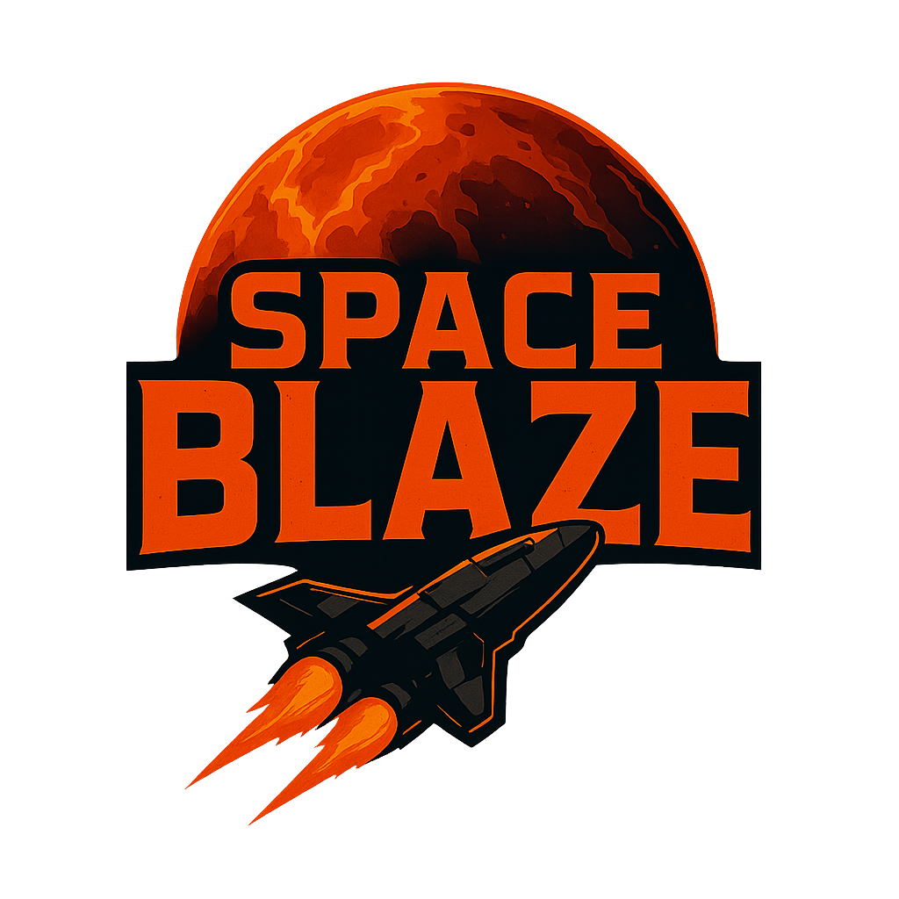

<p align="center">
  
</p>

## Story

A hostile, powerful planet is attempting to conquer your homeworld. You, the last hope of your people, are launched far across space to infiltrate and destroy the enemy planet and save your civilization. Armed with advanced weaponry and unwavering determination, you must overcome the planet's formidable defenses and emerge victorious. **Your goal is to achieve the highest possible score while defeating the boss planet.**

## Submission Content

* **Gameplay Video:** [Watch on YouTube](https://www.youtube.com/watch?v=Vq69oEfbsbs)
* **Unity Game Page:** [Play on Unity](https://play.unity.com/en/games/b5c958d2-09ee-4796-a025-6946a07fe35b/space-blaze)
* **Code Review Video:** [Watch on YouTube](https://www.youtube.com/watch?v=MMvNJBWmP-g)


## Controls

### Keyboard

* **Movement:** Arrow keys
* **Shoot:** Space
* **Upgrade 1:** 1
* **Upgrade 2:** 2

### Controller

* **Movement:** Right Joystick
* **Shoot:** X
* **Upgrade 1:** L1
* **Upgrade 2:** R1

## Gameplay Features

### Boss Mechanics & Phases

* **Multi-phase Boss:** The primary enemy is a planet with three distinct phases, each unlocked as its health drops.
* **Dynamic Stat Upgrades:** Boss stats (e.g., bullet count, attack speed, destroyer spawn rate) are upgraded during gameplay based on player score.
* **Phase Progression:**
  * **Phase 1 (100% - 67% HP):** Basic attacks with Big Bullet Shot and Destroyer Spawns. Special attacks occur at regular intervals.
  * **Phase 2 (67% - 33% HP):** Introduces Laser attacks alongside Phase 1 abilities. Increased aggression with faster special attack intervals.
  * **Phase 3 (33% - 0% HP):** Maximum difficulty with all attacks including Rage attack. Fastest special attack intervals for intense final battle.
* **Attack Types:**
  * **Big Bullet FireBall:** Large projectile towards the player.
  * **Bullet Barrage:** Rapid small shots.
  * **Laser:** lava beam that streched and moves in map.
  * **Rage Attack:** Direct dash toward the player.
  * **Destroyer Spawns:** Summons smaller enemy ships.

### Player Mechanics

* **Space Movement:** Gravity based movement with momentum and flame effect.
* **Auto-Aim:** Shots automatically target the nearest valid enemy.
* **Health System:** On-screen health bar with damage feedback and health pickups.
* **Dynamic Stat Upgrades:** Player stats (e.g., max HP, shot speed, acceleration, upgrade frequency) are upgraded as the player earns points. Two upgrades are presented to the player, and he chooses one fo them.

### Weapons & Enemy Types

* **Bullets:**
  * **Standard Bullet:** Direct projectile that travels in a straight line toward the target.
  * **Tracking Bullet:** Projectile that continuously adjusts its movement to follow the target.
* **Laser:** A powerful lava beam that stretches across the screen and moves dynamically, creating dangerous zones.
* **Destroyer Ships:** Smaller enemy units that spawn from the boss and attack with their own projectile patterns.

### Score & UI

* **Combo System:** Multiplier increases with consecutive hits; resets when player is damaged.
* **High Score & Leaderboard:** HighScore is displayed when player wins. 


## Project Architecture

The codebase is organized into modular subsystems that leverage common design patterns:

```
Assets/
├─ _SPC/
│  ├─ Attributes/     # Custom Unity attributes (InspectorButton, ReadOnly)
│  ├─ Core/          # Core systems and base functionality
│  │  ├─ Audio/      # AudioManager, SoundObject, music and sound effects
│  │  ├─ BaseScripts/ # Base classes and utilities
│  │  │  ├─ BaseMono/    # Base MonoBehaviour classes
│  │  │  ├─ Generics/    # Generic utilities (MonoPool, MonoSingleton)
│  │  │  ├─ InputSystem/ # Input system integration
│  │  │  └─ Managers/    # Core managers (GameManager, etc.)
│  │  └─ Scenes/     # Scene management
│  ├─ GamePlay/      # Game-specific systems
│  │  ├─ Entities/   # Player and enemy entities
│  │  │  ├─ EntitiesBaseScripts/ # Base entity classes
│  │  │  ├─ Enemies/     # Boss and destroyer enemies
│  │  │  └─ Player/      # Player controller and systems
│  │  ├─ Score/      # Score management and UI
│  │  ├─ Utils/      # Helper classes and extension methods
│  │  └─ Weapons/    # Bullet, laser, and weapon systems
│  └─ UML/          # Project documentation and architecture diagrams
```

* **Core Design Approach:** This codebase uses C# scripts and abstract base classes to define and share common workflows via inheritance. It follows the Template Method pattern.
* **Dependency Injection:** `BulletInitData` injects the bullet’s pool, target, and movement parameters into `Activate()`, decoupling the class from hard-coded dependencies. 
* **Singletons:** `AudioManager`, `GameManager`, `HighScoreManager`.
* **Object Pooling:** `SPCMonoPool` for bullets, sound objects, and other frequent spawns.
* **Event System:** `GameEvents` dispatches gameplay events (hit, damage, upgrade).

